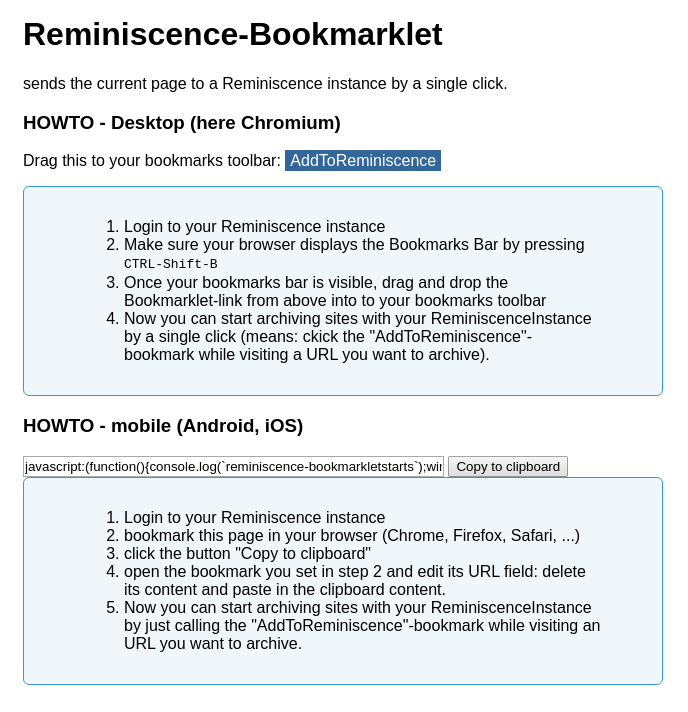

**This is a Work-In-Progress** for sending the current URL to
[Reminiscence](https://github.com/kanishka-linux/reminiscence) - an open-source self-hosted bookmark and archive manager.



## views provided

```
bookmarklet/         : shows doc
bookmarklet/get      : returns the bookmarklet (javascript)
bookmarklet/add-url/ : adds given url to the reminiscence-instance
                       (called by the bookmarklet, can also be used manually (HTTP-GET))
```

## installation

``` 
$ cd <path-to-your-reminiscence-sources>
$ git clone https://github.com/s3h10r/reminiscence-bookmarklet bookmarklet
```

## configuration

```
$ cd <path-to-your-reminiscence-sources>

# --- enable bookmarklet by including it in `reminiscence/urls.py` 

$ vi reminiscence/urls.py

    # add the following

        url(r'{}bookmarklet/'.format(custom_loc), include(('bookmarklet.urls','bookmarklet'), namespace='bookmarklet')),

      to urlpatterns, for example like this:

      urlpatterns = [
        url(r'{}admin/'.format(custom_loc), admin.site.urls),
        url(r'{}bookmarklet/'.format(custom_loc), include(('bookmarklet.urls','bookmarklet'), namespace='bookmarklet')),
        url(r'{}restapi/'.format(custom_loc), include('restapi.urls')),
        url(r'{}'.format(root_loc), include('pages.urls')),
      ]

# --- set the `URL_BASE` variable to the URL of your reminiscence-instance

  $ vi bookmarklet/views.py 

      URL_BASE = 'https://example.com'

# --- enable the bookmarklet-templates 

$ cd templates
$ ln -s ../bookmarklet/templates/bookmarklet/ .
```  

after configuration is done restart the reminiscence-instance 
(or rebuild the reminiscence-container if you're using docker).

## update

``` 
$ cd <path-to-your-reminiscence-sources>/bookmarklet
$ git pull
```
